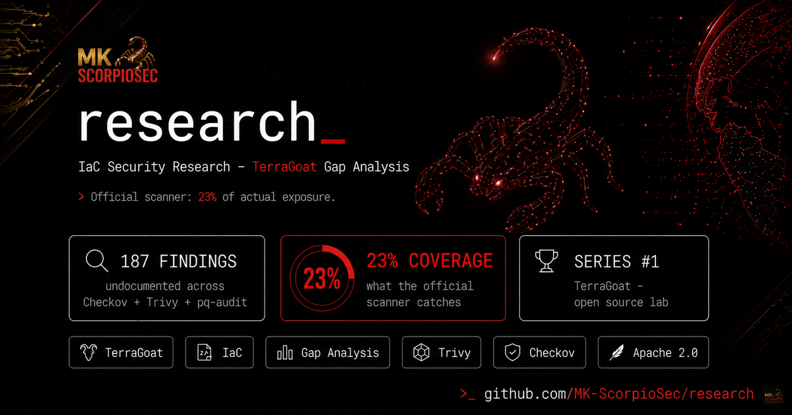

# research

 Banner generated with AI assistance · MK ScorpioSec

> Applied security research — IaC, AI agents, and infrastructure analysis. Raw evidence published with every finding.

---

## Studies

| # | Study | Description | Status |
|---|-------|-------------|--------|
| 1 | [TerraGoat gap analysis](terragoat-2026-04/) | 187 undocumented findings across Checkov, Trivy, and pq-audit. Running only the official scanner shows 23% of actual exposure. | `ready` |
| 2 | [PentAGI — AI agent security analysis](pentagi-2026-04/) | 4 CRITICAL findings in static analysis. 462 EXFILTRATION events + 24 PROMPT_INJECTION attempts in behavioral analysis. 73.7% threat rate across 274 requests. | `ready` |

---

## Methodology

Each study applies the full MK ScorpioSec research pipeline:
- Static analysis with multiple tools (not just the "official" one)
- Cross-tool gap matrix: what each scanner covers vs. misses
- Post-quantum cryptography layer via [pq-audit](https://github.com/mk-scorpiosec/pq-audit)
- Raw evidence published with every finding

---

## Open Source Tools

Tools developed or maintained by MK ScorpioSec and used in this research:

| Tool | Description | License |
|------|-------------|---------|
| [pq-audit](https://github.com/MK-ScorpioSec/pq-audit) | Post-quantum cryptography audit framework — 10-layer scan (code, cloud, deps, config, certs, network, containers, api, compliance, web3) with BROKEN_NOW / SNDL_VULNERABLE classification | Apache 2.0 |

Third-party tools used across studies:

| Tool | Vendor | License |
|------|--------|---------|
| [Trivy](https://github.com/aquasecurity/trivy) | Aqua Security | Apache 2.0 |
| [Checkov](https://github.com/bridgecrewio/checkov) | Bridgecrew / Palo Alto | Apache 2.0 |
| [TruffleHog](https://github.com/trufflesecurity/trufflehog) | Truffle Security | AGPL-3.0 |
| [Falco](https://github.com/falcosecurity/falco) | Falco Security | Apache 2.0 |

---

## Contact

Security disclosure: [GitHub Security Advisories](https://github.com/mk-scorpiosec/research/security/advisories)

*I don't hunt threats. I am the threat.*
