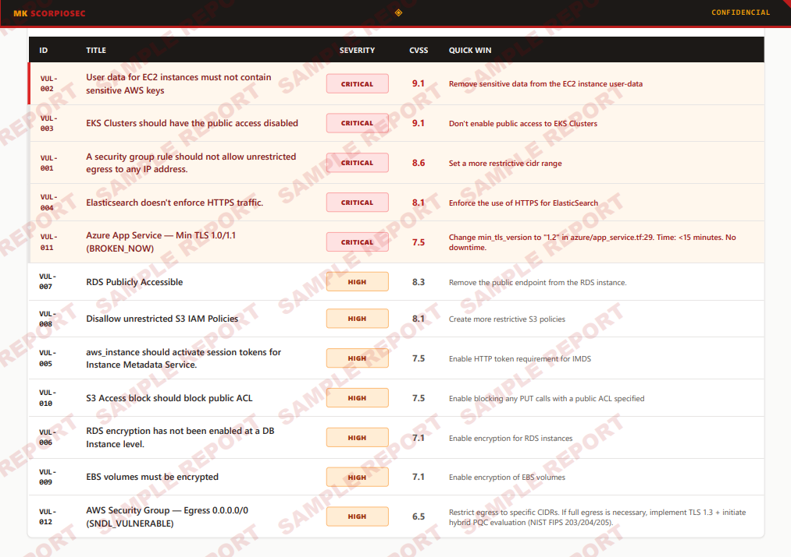

# TerraGoat IaC Security Gap Analysis
## MK ScorpioSec Research Series #1

> **TL;DR**: Bridgecrew's official documentation covers 56 TerraGoat findings (all via Checkov).
> Running Trivy + pq-audit against the same code reveals **243 findings — 187 undocumented**.
> You're seeing 23% of your exposure if you trust the official documentation alone.

---

## What This Study Is

[TerraGoat](https://github.com/bridgecrewio/terragoat) is Bridgecrew's intentionally vulnerable Terraform repository — the standard reference for IaC security scanner validation. Used by thousands of teams.

This study applies a multi-scanner pipeline against TerraGoat and maps the **gaps between what each tool finds**, including a post-quantum cryptography (PQC) lens via [pq-audit](https://github.com/MK-ScorpioSec/pq-audit).

---

## Key Finding

| Scanner | Findings | Documented by Bridgecrew |
|---|---|---|
| Checkov (official tool) | 56 | ✅ Yes |
| Trivy (Aqua Security) | 243 | ❌ 187 undocumented |
| pq-audit v2 (crypto lens) | 2 | ❌ 0 documented |

**187 findings are not covered in the official TerraGoat documentation.**

The most critical undocumented finding: Azure `app_service.tf:29` — TLS minimum set to 1.0/1.1. This is **BROKEN_NOW** (broken by classical standards today, not just post-quantum).

---

## Methodology

1. Static analysis with Trivy (IaC misconfiguration mode)
2. Static analysis with Checkov (without API key — reflects free-tier reality)
3. Post-quantum cryptography audit with pq-audit v2 (GAP-001 fixed — see findings)
4. Secret scanning with TruffleHog (expected: 0 findings on clean lab)
5. Cross-tool gap matrix: what each scanner covers vs. misses

Full report: [FINDINGS.md](FINDINGS.md)

---

## Report

A full security assessment report was generated from this analysis using the MK ScorpioSec report pipeline.



*Consolidated risk matrix — 12 selected findings across 4 severity tiers, 3 cloud providers.*

The report includes executive summary, per-finding CVSS scores, reproduction commands, Terraform remediation code, and a post-quantum cryptography layer not covered by any conventional scanner.

- **Demo PDF**: [`Reporte-TerraGoat-MK-ScorpioSec-Demo.pdf`](Reporte-TerraGoat-MK-ScorpioSec-Demo.pdf) — watermarked SAMPLE REPORT
- **Structured data**: [`terragoat_report_data.json`](terragoat_report_data.json) — machine-readable findings used to generate the report

---

## Files

```
terragoat-2026-04/
├── README.md                              ← this file
├── FINDINGS.md                            ← full technical report
├── terragoat_report_data.json             ← structured findings data
├── Reporte-TerraGoat-MK-ScorpioSec-Demo.pdf  ← demo report (watermarked)
├── assets/
│   └── TerraGoat-Consolidated_Risk_Matrix-Demo.png
└── evidence/
    ├── trivy-aws.json         (120 findings, full severity)
    ├── trivy-gcp.json         (40 findings, full severity)
    ├── trivy-azure.json       (83 findings, full severity)
    ├── checkov-aws.json       (215 terraform + 4 secrets + 2 dockerfile — Bridgecrew documents 56)
    └── pq-audit/
        ├── aws-v2.json        (2 PQC findings)
        ├── azure-v2.json      (1 BROKEN_NOW finding — TLS 1.0/1.1)
        └── gcp-v2.json        (0 findings)
```

---

## Why It Matters

> "If a vendor is selling you 'one tool covers everything,' they're selling you risk."

Running multiple scanners isn't paranoia — it's the only way to understand your actual attack surface. This study exists to make that gap visible and reproducible.

---

## Tools Used

| Tool | Vendor | License |
|---|---|---|
| [Trivy](https://github.com/aquasecurity/trivy) | Aqua Security | Apache 2.0 |
| [Checkov](https://github.com/bridgecrewio/checkov) | Bridgecrew / Palo Alto | Apache 2.0 |
| [TruffleHog](https://github.com/trufflesecurity/trufflehog) | Truffle Security | AGPL-3.0 |
| [pq-audit](https://github.com/MK-ScorpioSec/pq-audit) | MK ScorpioSec | Apache 2.0 |

---

## Found Something Similar in Your Stack?

If this research surfaces issues in your environment, MK ScorpioSec offers:

- Remediation playbooks tailored to your findings
- YARA rules for detection of active exploitation patterns
- Identity/access hardening (Okta, AWS IAM, GCP IAM)
- Implementation engagement + retest validation

→ [mkscorpiosec.com](https://mkscorpiosec.com) · mike@mkscorpiosec.com

---

*Part of the [MK ScorpioSec research repository](https://github.com/MK-ScorpioSec/research).*
*Methodology: Privacy-by-Design — analysis in controlled local environments, no sensitive data exfiltrated.*
